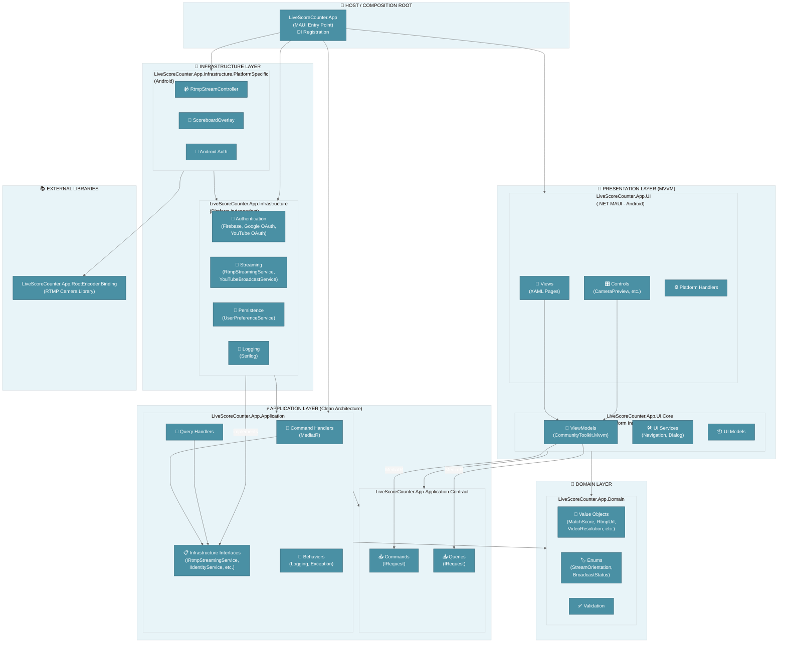

# 👐 LiveScoreCounter.App-showcase

## Availability

This repository contains a simplified showcase of a private project LiveScoreCounter.App currently under development.
Full project is private. More details or code samples available upon request.
Below is the copied content of a project's README file.

# 📺 LiveScoreCounter.App

A .NET MAUI Android application for live streaming sports scores with real-time scoreboard overlay to YouTube.

[](https://dotnet.microsoft.com/)
[](https://dotnet.microsoft.com/apps/maui)
[](LICENSE)

## 📖 Table of Contents

- [Features](#-features)
- [Architecture](#-architecture)
- [Layer Description](#-layer-description)
- [Key Patterns](#-key-patterns)
- [Project Dependencies](#-project-dependencies)
- [Data Flow Example](#-data-flow-example)
- [Getting Started](#-getting-started)
- [Key Files Reference](#-key-files-reference)
- [Contributing](#-contributing)

---

## ✨ Features

- 📹 **Live RTMP Streaming** - Stream directly to YouTube with camera preview
- 🎯 **Real-time Scoreboard Overlay** - Display match scores on your live stream
- 🔐 **YouTube Integration** - OAuth authentication and broadcast management
- ⚙️ **Configurable Settings** - Resolution, FPS, visibility, and more
- 📊 **Adaptive Bitrate** - Automatic quality adjustment based on network conditions

---

## 🏗️ Architecture

This application follows **Clean Architecture** principles with **MVVM** pattern for the presentation layer.



---

## 📋 Layer Description

| Layer                 | Project                                              | Responsibility                                                           |
| --------------------- | ---------------------------------------------------- | ------------------------------------------------------------------------ |
| **🎨 Presentation**   | `UI` + `UI.Core`                                     | MVVM pattern, XAML views, ViewModels (CommunityToolkit.Mvvm), navigation |
| **⚡ Application**    | `Application` + `Application.Contract`               | CQRS (MediatR), command/query handlers, infrastructure interfaces        |
| **💎 Domain**         | `Domain`                                             | Value Objects, Enums, business logic, validation rules                   |
| **🔧 Infrastructure** | `Infrastructure` + `Infrastructure.PlatformSpecific` | Service implementations, Firebase, YouTube API, RTMP streaming           |
| **🚀 Host**           | `LiveScoreCounter.App`                               | Composition Root, DI container setup, MAUI configuration                 |

---

## 🔑 Key Patterns

### CQRS + MediatR

```
┌─────────────────────────────────────────────────────────────────┐
│  CQRS + MediatR                                                 │
│  ┌──────────┐    ┌────────────┐    ┌──────────────────────┐    │
│  │ ViewModel │───▶│  Command   │───▶│  CommandHandler      │    │
│  │          │    │  (Contract)│    │  (Application)       │    │
│  └──────────┘    └────────────┘    └──────────────────────┘    │
└─────────────────────────────────────────────────────────────────┘
```

### Dependency Inversion Principle

```
┌─────────────────────────────────────────────────────────────────┐
│  Dependency Inversion Principle                                 │
│  ┌──────────────┐         ┌─────────────────────────────────┐  │
│  │ Application  │────────▶│ IInterface (in Application)    │  │
│  │              │         │         ▲                       │  │
│  └──────────────┘         │         │ implements            │  │
│                           │ ┌───────┴───────────────────┐   │  │
│                           │ │ Infrastructure impl       │   │  │
│                           │ └───────────────────────────┘   │  │
│                           └─────────────────────────────────┘  │
└─────────────────────────────────────────────────────────────────┘
```

---

## 📦 Project Dependencies

```
                    ┌──────────────────┐
                    │   Domain         │  ◀── No dependencies (pure business logic)
                    └────────┬─────────┘
                             │
              ┌──────────────┼──────────────┐
              │              │              │
              ▼              ▼              ▼
   ┌──────────────┐  ┌───────────────┐  ┌────────────┐
   │  App.Contract│  │  Application  │  │  UI.Core   │
   │  (Commands)  │◀─│  (Handlers)   │  │ (ViewModels)│
   └──────────────┘  └───────┬───────┘  └─────┬──────┘
                             │                │
                             ▼                │
                   ┌─────────────────┐        │
                   │ Infrastructure  │        │
                   │ (Service impls) │        │
                   └────────┬────────┘        │
                            │                 │
                            ▼                 ▼
              ┌─────────────────────────────────────┐
              │    Infrastructure.PlatformSpecific  │
              │         (Android RTMP)              │
              └─────────────────────────────────────┘
                            │
                            ▼
              ┌─────────────────────────────────────┐
              │           UI (MAUI Views)           │
              └─────────────────────────────────────┘
                            │
                            ▼
              ┌─────────────────────────────────────┐
              │    LiveScoreCounter.App (Host)      │
              │      Composition Root + DI          │
              └─────────────────────────────────────┘
```

---

## 🔄 Data Flow Example

### Starting a Stream

```
┌─────────────────────────────────────────────────────────────────────────────┐
│                                                                             │
│  1. User taps "Start Stream" button                                         │
│     │                                                                       │
│     ▼                                                                       │
│  ┌─────────────────────┐                                                    │
│  │ BroadcastCameraPage │  (UI Layer - XAML View)                            │
│  └──────────┬──────────┘                                                    │
│             │ Data Binding                                                  │
│             ▼                                                               │
│  ┌──────────────────────────┐                                               │
│  │ BroadcastCameraViewModel │  (UI.Core - ViewModel)                        │
│  │   StartStreamCommand     │                                               │
│  └──────────┬───────────────┘                                               │
│             │ _mediator.Send(new StartStreamCommand(...))                   │
│             ▼                                                               │
│  ┌──────────────────────────┐                                               │
│  │ StartStreamCommandHandler│  (Application Layer)                          │
│  └──────────┬───────────────┘                                               │
│             │ _rtmpStreamingService.StartStreamingAsync(...)                │
│             ▼                                                               │
│  ┌──────────────────────────┐                                               │
│  │   RtmpStreamingService   │  (Infrastructure Layer)                       │
│  └──────────┬───────────────┘                                               │
│             │ _streamController.StartStreamAsync(...)                       │
│             ▼                                                               │
│  ┌──────────────────────────┐                                               │
│  │   RtmpStreamController   │  (Infrastructure.PlatformSpecific - Android)  │
│  └──────────┬───────────────┘                                               │
│             │ RootEncoder library calls                                     │
│             ▼                                                               │
│  ┌──────────────────────────┐                                               │
│  │  RootEncoder.Binding     │  (External Library - Java binding)            │
│  │    → RTMP Server         │                                               │
│  └──────────────────────────┘                                               │
│                                                                             │
└─────────────────────────────────────────────────────────────────────────────┘
```

---

## 🚀 Getting Started

### Prerequisites

- [.NET 10 SDK](https://dotnet.microsoft.com/download)
- [Visual Studio 2022](https://visualstudio.microsoft.com/) with .NET MAUI workload
- Android SDK (API 29+)

### Build and Run

```bash
# Clone the repository
git clone https://github.com/SirLecram/LiveScoreCounter.App.git
cd LiveScoreCounter.App

# Restore dependencies
dotnet restore

# Build the solution
dotnet build

# Run on Android emulator/device
dotnet build -t:Run -f net10.0-android
```

### Configuration

Copy `appsettings.Local.json.template` to `appsettings.Local.json` and configure:

```json
{
    "GoogleOAuth": {
        "ClientId": "your-client-id",
        "ClientSecret": "your-client-secret"
    },
    "Firebase": {
        "ApiKey": "your-firebase-api-key"
    }
}
```

---

## 📁 Key Files Reference

| Feature              | Files to Check                                                                    |
| -------------------- | --------------------------------------------------------------------------------- |
| **Streaming**        | `RtmpStreamingService.cs`, `RtmpStreamController.cs`, `IRtmpStreamingService.cs`  |
| **Scoreboard**       | `ScoreboardOverlay.cs`, `IScoreboardOverlay.cs`, `MatchScore.cs`                  |
| **Authentication**   | `FirebaseIdentityService.cs`, `YouTubeOAuthService.cs`                            |
| **YouTube API**      | `YouTubeBroadcastService.cs`, `YouTubeChannelAccess.cs`                           |
| **ViewModels**       | `BroadcastCameraViewModel.cs`, `BroadcastOptionsViewModel.cs`                     |
| **DI Setup**         | `InfrastructureRegistrationExtensions.cs`, `ApplicationRegistrationExtensions.cs` |
| **Adaptive Bitrate** | `AdaptiveBitrateController.cs`, `AdaptiveBitrateSettings.cs`                      |

---

## 🎯 Onboarding Guide - Quick Start for New Developers

| Step | What to explore          | Why                                                                              |
| ---- | ------------------------ | -------------------------------------------------------------------------------- |
| 1️⃣   | **Domain** layer         | Understand the business model (`MatchScore`, `VideoResolution`, `RtmpUrl`, etc.) |
| 2️⃣   | **Application.Contract** | See available commands/queries - this is the "API" of the backend                |
| 3️⃣   | **UI.Core/ViewModels**   | Learn how UI communicates with backend via MediatR                               |
| 4️⃣   | **Infrastructure**       | Explore external service implementations (YouTube, Firebase, RTMP)               |

---

## 🧪 Testing

```bash
# Run all tests
dotnet test

# Run specific test project
dotnet test tests/LiveScoreCounter.App.Domain.Tests
dotnet test tests/LiveScoreCounter.App.Application.Tests
dotnet test tests/LiveScoreCounter.App.Infrastructure.Tests
```

---

## 📂 Project Structure

```
LiveScoreCounter.App/
├── src/
│   ├── LiveScoreCounter.App/                    # Host - MAUI entry point, DI
│   ├── LiveScoreCounter.App.UI/                 # Views, Controls, Handlers
│   ├── LiveScoreCounter.App.UI.Core/            # ViewModels, UI Services
│   ├── LiveScoreCounter.App.Application/        # Command/Query Handlers
│   ├── LiveScoreCounter.App.Application.Contract/ # Commands, Queries, DTOs
│   ├── LiveScoreCounter.App.Domain/             # Value Objects, Enums
│   ├── LiveScoreCounter.App.Infrastructure/     # Service implementations
│   └── LiveScoreCounter.App.Infrastructure.PlatformSpecific/ # Android-specific
├── tests/
│   ├── LiveScoreCounter.App.Domain.Tests/
│   ├── LiveScoreCounter.App.Application.Tests/
│   ├── LiveScoreCounter.App.Application.ComponentTests/
│   ├── LiveScoreCounter.App.Infrastructure.Tests/
│   └── LiveScoreCounter.App.UI.Core.Tests/
├── libraries/
│   └── LiveScoreCounter.App.RootEncoder.Binding/ # Java library binding
└── README.md
```

---

## 🤝 Contributing

1. Fork the repository
2. Create a feature branch (`git checkout -b feature/amazing-feature`)
3. Commit your changes (`git commit -m 'Add amazing feature'`)
4. Push to the branch (`git push origin feature/amazing-feature`)
5. Open a Pull Request

---

## 📄 License

This project is licensed under the MIT License - see the [LICENSE](LICENSE) file for details.
